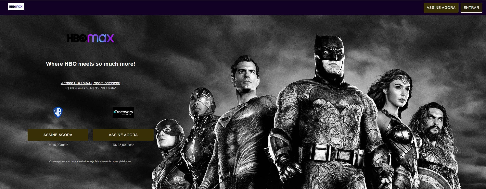

HBO MAX - Clone (estilizado)

<h2>Descrição do Projeto</h2>
 
Projeto de clone da página da HBO MAX (estilizado).
Foram utilizadas as seguintes tecnologias: o HTML, CSS,GULP, SASS e Javascript para recriar a página inicial da plataforma de stream HBO MAX.

<h2>Visualização Online</h2>

Site hospedado na Vercel: https://clone-hbo-max-veqj.vercel.app/#

<h2>
    Pré-visualização
 </h2>
 

## Skills utilizadas:

 
  
  
  
  
  
  

